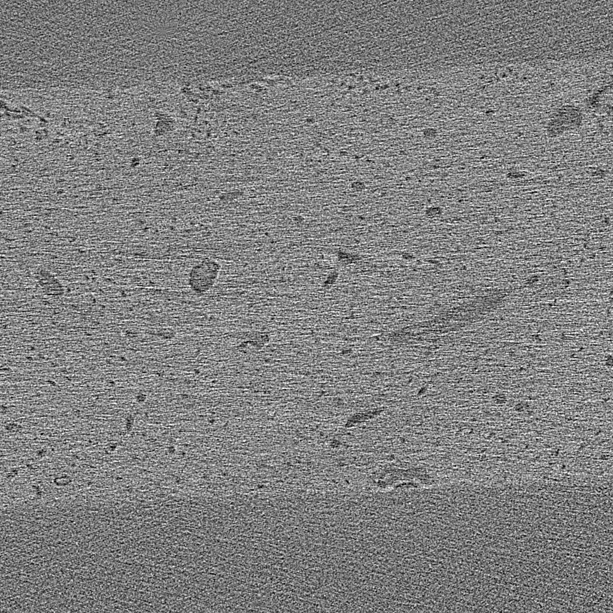
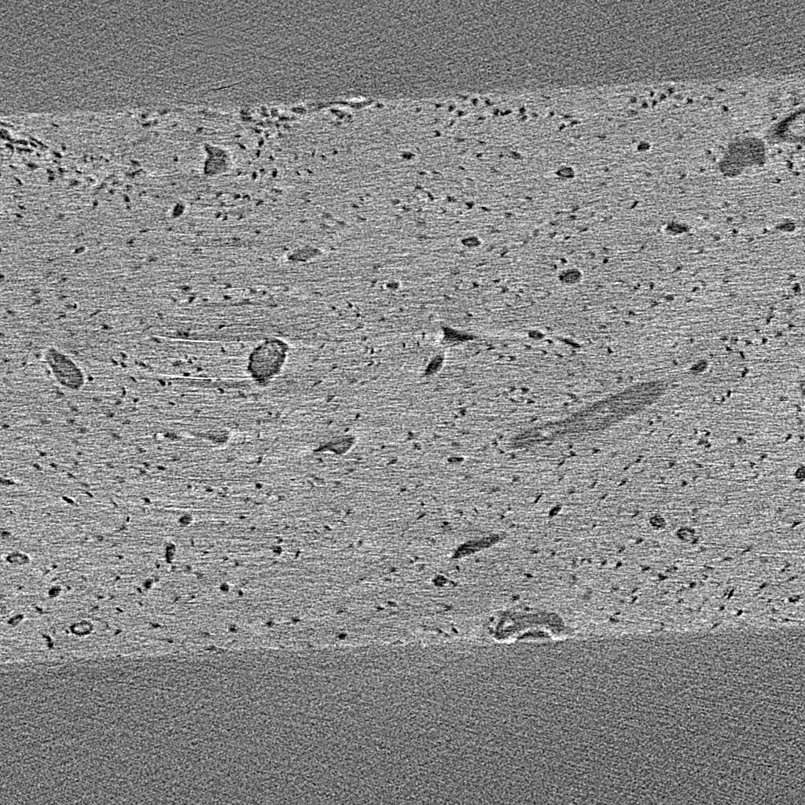
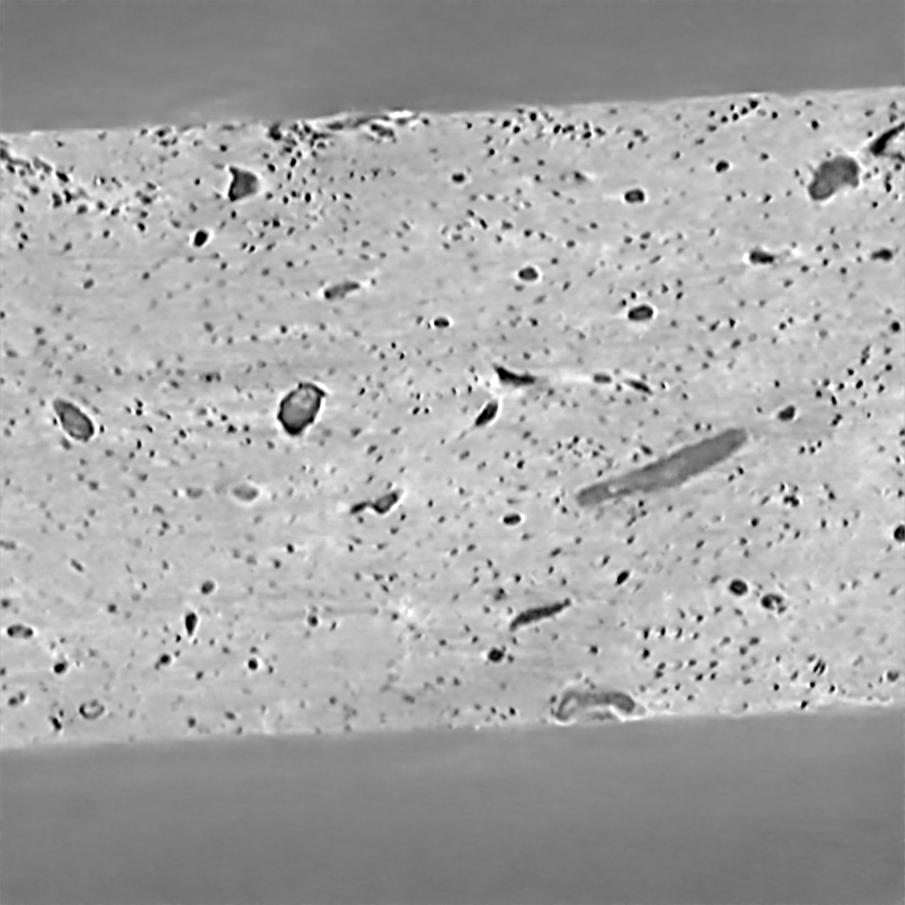
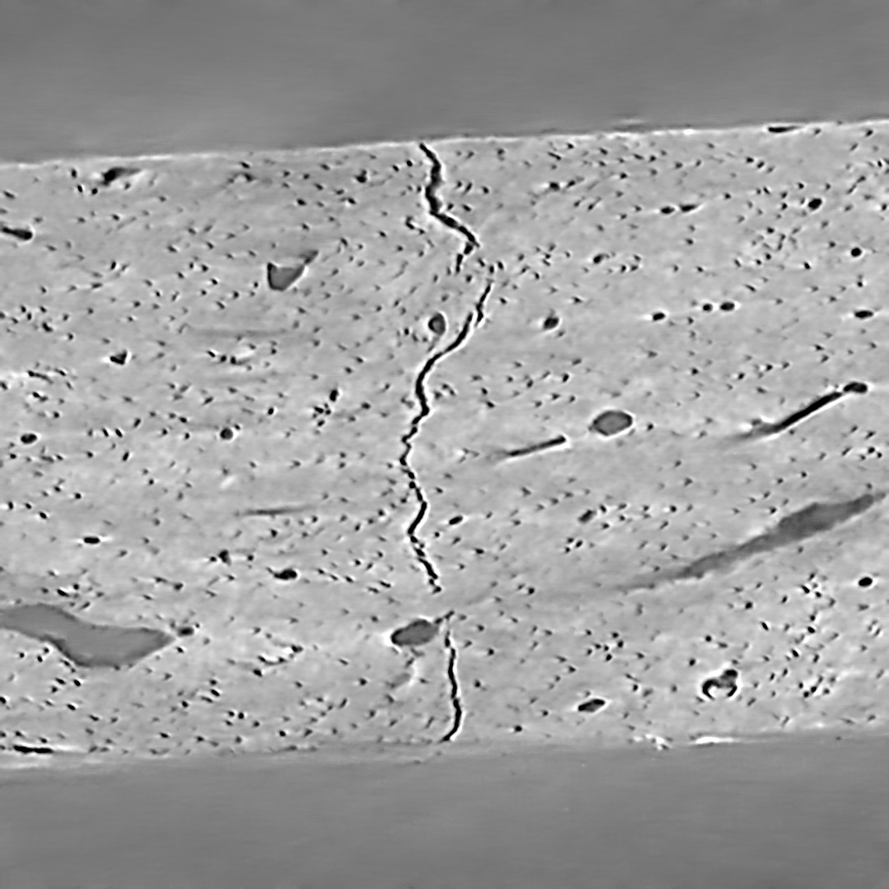
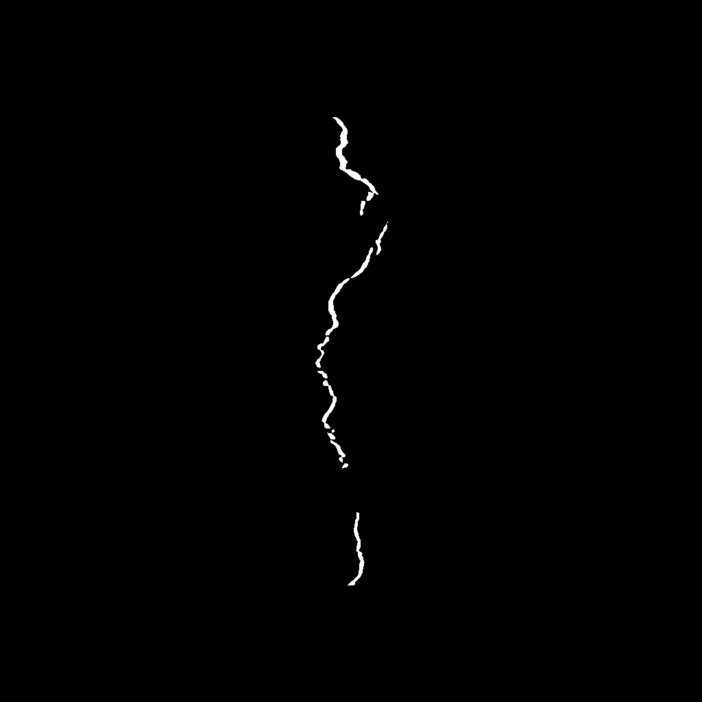
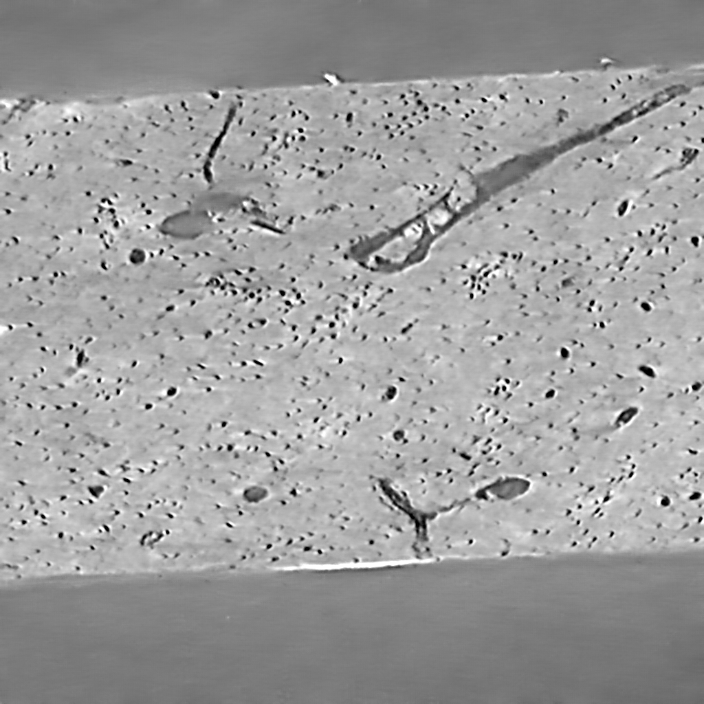
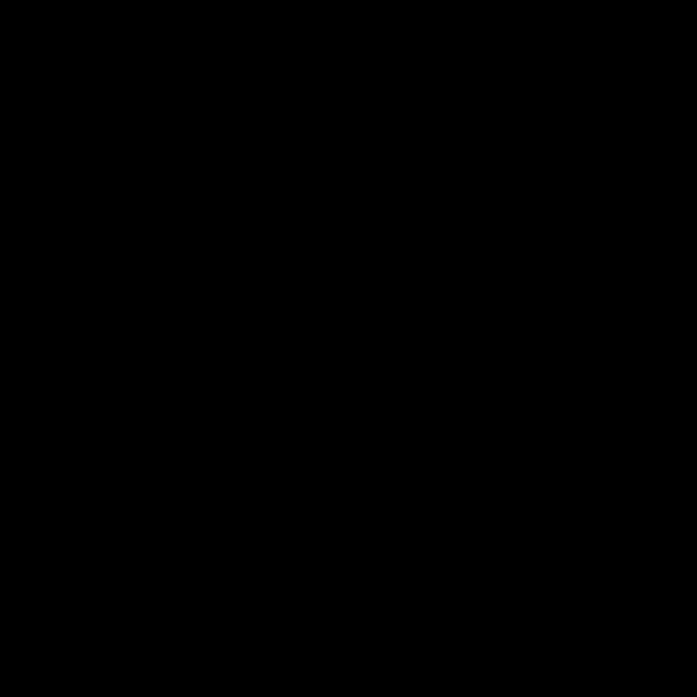
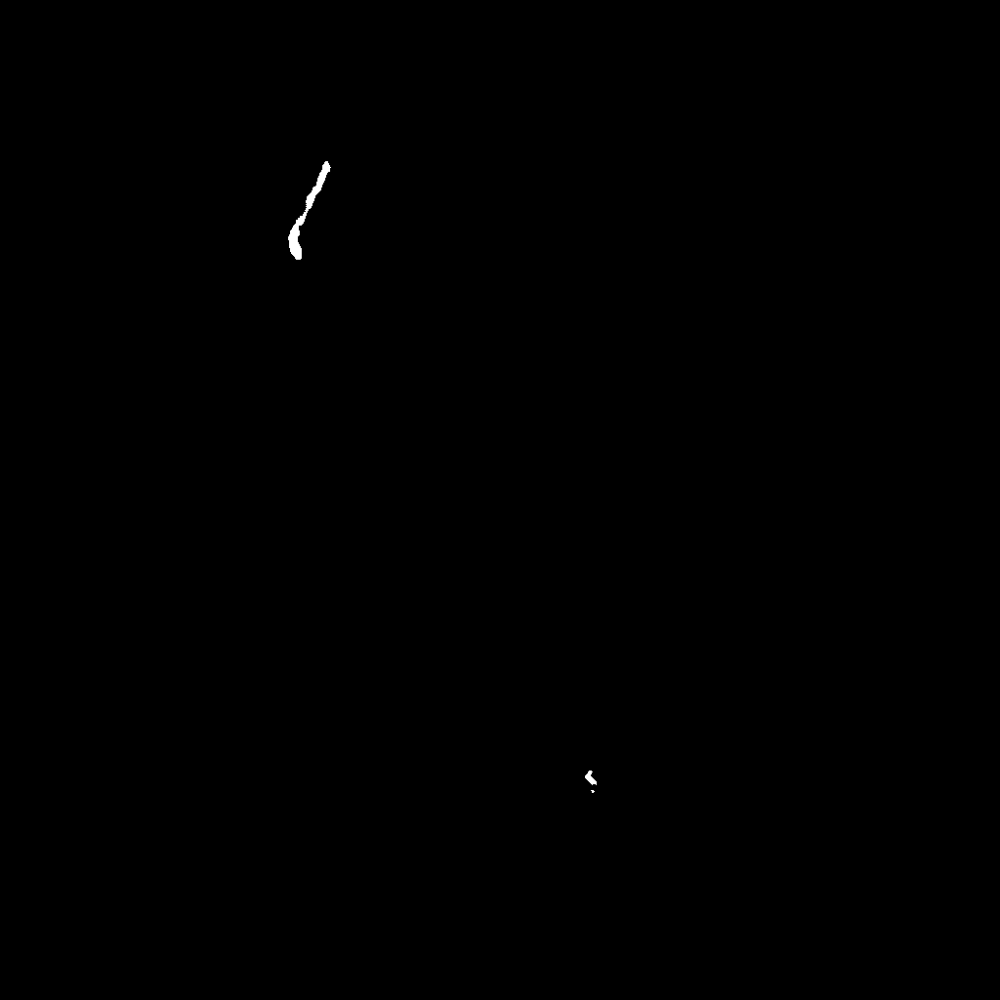

# U-net

This repository contains a custom implementation of the U-net architecture using Pytorch. The U-net was introduced by [Ronneberger](https://arxiv.org/abs/1505.04597) et al. In the abstract they describe the network architecture as a "contracting path to capture context and a symmetric expanding path that enables precise localization." The network consists of 3x3 convolutions followed by max pooling to encode or contract the input. The expansion is completed using transposed convolutions. This network was introduced for image segmentation. In this project both denoising and segmentation were performed using computed tomography (CT) images of bone.

For both tasks the network layers were adjusted to accomodate a larger image size and still be able to run on the GPU. In these examples the layers used were 32, 64, 128, 256, and 512. The input to the network was a 3-dimensional image stack consisting of 5 slices. This dimensionality was used because CT data is sequential and having additionaly slices could add more context for the network.

  

## Denoising

Denoising, or regression, of CT images is of interest because it enables faster acquisition times with less exposure to radiation. To train the network to denoise images a high-quality image was acquired followed by a low-quality (noisy) image of the same sample. These images were combined to create a supervised dataset. By minimizing the MSE between the U-net output and the target high-quality images the network learned to reduce noise from the input image. Below is an example of the denoised image after only 10 epochs of training.  

<table>
  <tr>
    <td> <b>Input</b> </td>
    <td> <b>Target</b> </td>
    <td> <b>U-net Output</b> </td>
  </tr>
  <tr>
    <td>  </td>
    <td>  </td>
    <td>  </td>
  </tr>
  <caption></caption>
 </table>
 
   
 
 ## Segmentation
 
 The segmentation task in this project was to localize the crack within the bone. Segmenting the crack by hand is a very time consuming process, so the ability to segement using the network is very appealing. To generate a training dataset the denoised images were used as input, and the crack was segmented by hand for many of the scans. The loss function in this application was cross-entropy. The network was used to identify two classes: crack and not crack. Below is an example of the segmentation performance of the network after only 10 epochs. 
 
 <table>
  <tr>
    <td> <b>Input</b> </td>
    <td> <b>Target</b> </td>
    <td> <b>U-net Output</b> </td>
  </tr>
  <tr>
    <td>  </td>
    <td>  </td>
    <td>  </td>
  </tr>
 </table>
 
   
 
 The network performed quite well when there was a crack in the image. At times the network would identify a crack when there was no crack present. This generally occured when a natural feature in the bone had a similar orientation and geometry as some of the cracks. Below is an example of one of these occurances. 
 
 <table>
  <tr>
    <td> <b>Input</b> </td>
    <td> <b>Target</b> </td>
    <td> <b>U-net Output</b> </td>
  </tr>
  <tr>
    <td>  </td>
    <td>  </td>
    <td>  </td>
  </tr>
 </table>
  
